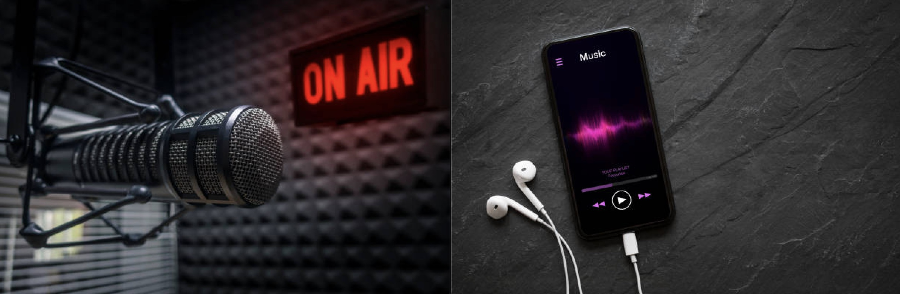

# DIGHUM101_Final_Project_Williams

Abstract: This project examines the differences between songs that are played on the radio and the streaming prefrences of audiences. Data showing the variation in songs played on the radio versus streamed music was collected and analyzed in this repository. Audience taste in radio and streaming once lacked strong variation, but this has changed from 2013 to 2022. Further, the number of unique words in streamed music has increased, while the number of unique words in songs played on the radio has remained simular. 

 
